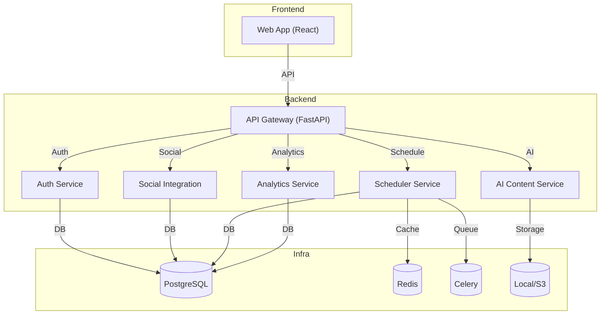

# AI-Assisted Social Media Content Scheduler

A scalable, production-ready web app for scheduling and managing social media posts across multiple platforms (Instagram, TikTok, etc.) with AI-powered caption and hashtag generation.

---

## Features
- User authentication (JWT)
- Connect Instagram and TikTok accounts
- Schedule posts with calendar
- AI-generated captions/hashtags (local Hugging Face model)
- Analytics dashboard
- Team-ready, extensible backend (FastAPI, Celery, PostgreSQL, Redis)
- Modern React frontend (Material-UI)

---

## Architecture Diagram



---

## Local Development

### Prerequisites
- Docker & Docker Compose
- Node.js & npm (for frontend)

### Backend (API, Celery, DB, Redis)
```sh
cp backend/.env.example backend/.env  # or create backend/.env manually
# Edit secrets as needed

docker-compose up --build
```
- API docs: [http://localhost:8000/docs](http://localhost:8000/docs)

### Frontend (React)
```sh
cd frontend
npm install
npm run dev
```
- App: [http://localhost:5173](http://localhost:5173)

---

## Deployment
- See README sections above for Docker Compose setup.
- For production, use a VPS (DigitalOcean, Hetzner, AWS Lightsail, etc.)
- Set strong secrets in `backend/.env`.

---

## Extending
- Add more social platforms by extending `app/social.py` and Celery tasks.
- Replace AI logic in `app/ai.py` with your own models or APIs.
- Use Alembic for DB migrations in production.

---

## License
MIT 